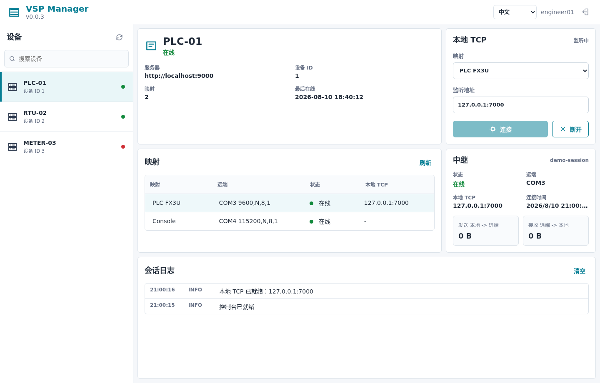

# VSP - Virtual Serial Port Cloud Platform

**English** | **[中文](README.md)**

[](https://github.com/wayyoungboy/serialserver/actions/workflows/release.yml)
[](https://opensource.org/licenses/MIT)
[](https://go.dev/)

VSP (Virtual Serial Port) is a remote serial gateway for PLC debugging, IoT device management, and industrial automation. The current architecture keeps serial settings on the field device, while the cloud server authenticates users and devices, pairs relay sessions, forwards binary frames, and records audit logs.

## Windows GUI Preview



## Documentation

| Document | Audience | Contents |
|----------|----------|----------|
| [User Manual](docs/user-manual-en.md) | Administrators, field operators, desktop users | Device creation, field agent setup, Windows GUI, CLI gateway, and troubleshooting |
| [Relay Protocol](docs/relay-protocol.md) | Developers and integrators | WebSocket hello messages, mapping state, and binary forwarding rules |
| [Windows Release Checklist](docs/windows-release-checklist.md) | Release owners and testers | Icons, Wails build, NSIS installer, install/start/uninstall validation |
| [Test Notes](tests/README.md) | Developers and CI maintainers | Unit tests and Linux pseudo-terminal serial relay E2E |

## Architecture

```
[Serial device] <-> [device-agent] <-> [vsp-server relay] <-> [VSPManager / desktop-gateway] <-> [127.0.0.1:PORT] <-> [debug tool]
```

The first release exposes a local TCP endpoint such as `127.0.0.1:7000`. Virtual COM support is reserved for a later gateway adapter.

## Components

| Component | Language | Location | Purpose |
|-----------|----------|----------|---------|
| **vsp-server** | Go | `vsp-server/` | control plane, device identity, user auth, relay pairing, binary forwarding, and audit logs |
| **device-agent** | Go | `vsp-client/cmd/device-agent/` | Runs at the field site, opens the physical serial port, and connects to `/api/relay/device` with DeviceKey |
| **desktop-gateway** | Go | `vsp-client/cmd/desktop-gateway/` | Creates a local TCP endpoint and connects to `/api/relay/gateway` with a user JWT |
| **vsp-windows** | Go + Wails | `vsp-windows/` | Windows GUI for login, device mapping selection, local TCP gateway control, and bilingual UI |

## Quick Start

See the [User Manual](docs/user-manual-en.md) for full step-by-step usage. The minimum flow is:

### 1. Start the Server

```bash
cd vsp-server
go build -o vsp-server ./cmd
./vsp-server
```

After startup:

- Web console: `http://localhost:9000`
- REST API: `http://localhost:9000/api`
- Default admin: `admin` / `admin123`

### 2. Create a Device

Create a device from the web console or API. The generated DeviceKey is only for the field-side `device-agent`.

### 3. Start the Field Agent

```bash
cd vsp-client
go build -o device-agent ./cmd/device-agent
./device-agent \
  -server localhost:9000 \
  -key <device_key> \
  -mapping plc \
  -name "PLC" \
  -port COM3 \
  -baud 9600
```

Serial settings are local to the field agent and are announced in the hello message.

### 4. Start the Desktop Gateway

Use VSPManager, or run the CLI gateway after logging in and obtaining a user JWT:

```bash
cd vsp-client
go build -o desktop-gateway ./cmd/desktop-gateway
./desktop-gateway \
  -server localhost:9000 \
  -token <user_jwt> \
  -device-id 1 \
  -mapping plc \
  -listen 127.0.0.1:7000
```

Desktop access requires a user login token and a device ID. DeviceKey is not accepted as a remote-access password.

Then point your desktop tool at `127.0.0.1:7000`.

## API

### Authentication

```text
POST /api/auth/register
POST /api/auth/login
```

### Devices

```text
GET    /api/devices
POST   /api/devices
GET    /api/devices/:id
PUT    /api/devices/:id
DELETE /api/devices/:id
POST   /api/devices/:id/regenerate-key
GET    /api/devices/:id/mappings
```

Device REST APIs manage cloud-side identity and metadata only. Serial parameters are not stored as server-controlled device configuration.

### Relay

```text
WS /api/relay/device
WS /api/relay/gateway
```

See [docs/relay-protocol.md](docs/relay-protocol.md) for the hello messages, mapping metadata, and binary frame behavior.

## Build

```bash
make build-server
make build-client
make build-windows
```

Generate the Windows app icon assets and build a standard per-user NSIS installer:

```powershell
cd vsp-windows
go run tools/gen_windows_assets.go
wails build -clean
makensis /DAPP_VERSION=0.0.3 packaging/windows/VSPManager.nsi
```

The installer is written to `vsp-windows/build/installer/` and creates Start Menu, desktop shortcut, and uninstall entries.

Use [docs/windows-release-checklist.md](docs/windows-release-checklist.md) before release to verify icons, Wails build output, the NSIS installer, install/start behavior, and uninstall cleanup.

Validation commands:

```bash
cd vsp-server && go test ./...
cd vsp-client && go test ./...
cd vsp-windows && go test ./...
cd vsp-windows/frontend && npm run build
cd tests/e2e && go test ./...
```

`tests/e2e` runs on Linux and uses a pseudo-terminal to simulate a serial device. It starts a real `vsp-server`, `device-agent`, and `desktop-gateway`, then verifies TCP-to-serial and serial-to-TCP byte forwarding.

## Project Structure

```text
serialserver/
├── vsp-server/             # Cloud server and relay
├── vsp-client/             # device-agent and desktop-gateway
├── vsp-windows/            # Windows GUI gateway
├── docs/user-manual.md     # Chinese user manual
├── docs/user-manual-en.md  # English user manual
├── docs/relay-protocol.md        # relay protocol
├── docs/windows-release-checklist.md
├── tests/                  # Test helpers and Linux PTY E2E
├── Makefile
└── README.md
```

## Requirements

- Go 1.25+
- Node.js 20+ for the Windows GUI frontend
- Wails CLI for building the Windows GUI
- NSIS for building the Windows installer

## License

[MIT License](LICENSE)
